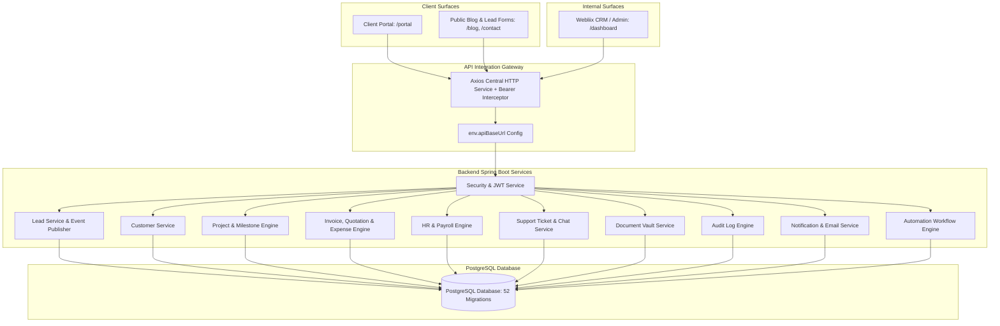

# Webliix System Module Inventory & Dependency Map

## 1. System Architecture Overview

The Webliix Platform consists of:
- **Backend**: Spring Boot 3 Java 17 REST API (`Backend/webliix`) with PostgreSQL, Hibernate/JPA, Flyway migrations, Spring Security 6 (JWT stateless + Role-Based Access Control), Spring Events, and WebSocket/STOMP.
- **CRM Application**: React 19 + TypeScript + MUI frontend (`Frontend/frontend`) for internal administrators, managers, and employees.
- **Client Portal**: Dedicated customer experience surface (`/portal`) for external clients, with secure multi-tenant isolation, project tracking, document vault, and live helpdesk tickets.
- **Database**: PostgreSQL with 52 versioned Flyway migrations.

---

## 2. Module Inventory Matrix

| Module | Backend Package / Controllers | Frontend Modules & Routes | Database Tables | Ownership & Responsibilities |
| :--- | :--- | :--- | :--- | :--- |
| **Authentication & Users** | `com.webliix.security` (`AuthController`, `UserController`, `ApiTokenController`) | `src/modules/auth`, `src/modules/system` (`/login`, `/register`, `/verify-email`, `/settings`) | `users`, `roles`, `user_roles`, `refresh_tokens`, `user_api_tokens` | JWT issuance, refresh tokens, role assignment, user CRUD, API token management. |
| **Leads & Pipeline** | `com.webliix.crm.lead` (`LeadController`, `PublicLeadController`) | `src/modules/leads` (`/leads`, `/leads/create`, `/leads/:id/edit`) | `leads` | Ingestion of sales inquiries, pipeline tracking, status workflows, and lead-to-customer conversion. |
| **Customer Accounts** | `com.webliix.crm.customer` (`CustomerController`) | `src/modules/customers` (`/customers`) | `customers`, `customer_contacts`, `customer_notes` | Enterprise client records, contacts, billing profiles, and project linkages. |
| **Projects & Milestones** | `com.webliix.projects` (`ProjectController`) | `src/modules/projects` (`/projects`, `/projects/:id`) | `projects`, `project_members`, `project_milestones`, `project_tasks`, `project_comments` | Project lifecycle management, auto-generated phases, task delegation, architecture specs, progress tracking, and client comments. |
| **Client Portal** | `com.webliix.portal` (`PortalAuthController`, `PortalDashboardController`), `ProjectController`, `TicketController`, `StorageController` | `src/modules/portal` (`/portal`) | `portal_users`, `projects`, `tickets`, `stored_files`, `notifications` | Client-facing portal for viewing projects, deliverables, documents, support tickets, and notifications. |
| **Finance: Invoices** | `com.webliix.finance.invoice` (`InvoiceController`), `com.webliix.finance.payment` (`PaymentController`) | `src/modules/invoices` (`/invoices`) | `invoices`, `invoice_items`, `payments` | Invoicing client projects, line items, taxes, payment transactions, and payment tracking. |
| **Finance: Quotations** | `com.webliix.finance.quotation` (`QuotationController`) | `src/modules/quotations` (`/quotations`) | `quotations`, `quotation_items` | Sales proposals and estimates, with one-click conversion to invoices. |
| **Finance: Expenses** | `com.webliix.finance.expense` (`ExpenseController`) | `src/modules/expenses` (`/expenses`) | `expenses` | Company expenditures, hosting/infrastructure bills, software subscriptions, and approvals. |
| **HR & Payroll** | `com.webliix.hr` (`EmployeeController`, `DepartmentController`, `DesignationController`, `PayrollController`, `AttendanceController`, `LeaveController`) | `src/modules/hr` (`/hr/employees`, `/hr/payroll`) | `employees`, `departments`, `designations`, `payrolls`, `attendance`, `leave_requests`, `leave_balances` | Employee records, department hierarchy, automated monthly payroll generation, attendance, and leave management. |
| **Support Helpdesk** | `com.webliix.tickets` (`TicketController`, `PublicTicketController`) | `src/modules/tickets`, `src/modules/portal` (`/tickets`, `/portal`) | `tickets`, `ticket_comments`, `ticket_attachments` | Customer service ticketing, multi-agent live chat, priority SLAs, internal vs public comments, and status resolution. |
| **Document Vault** | `com.webliix.storage` (`StorageController`) | `src/modules/documents`, `src/modules/portal`, `src/modules/customers` | `stored_files` | Multi-category document storage (`CONTRACT`, `SPECIFICATION`, `BRIEF`, `DELIVERABLE`, `PROPOSAL`, `NDA`, `DESIGN`, `REPORT`, `INVOICE`, `OTHER`) with downloads. |
| **Audit & Security** | `com.webliix.audit` (`AuditController`) | `src/modules/audit` (`/audit`) | `audit_logs` | Immutable audit trail across all subsystems with actor, IP, timestamp, action, module, and outcome. |
| **Notifications** | `com.webliix.notifications` (`NotificationController`) | `src/shared/components/ui/notification`, `src/modules/portal` | `notifications`, `notification_preferences`, `email_templates` | Real-time event notifications, unread counts, email templates, and delivery settings. |
| **Automations** | `com.webliix.automations` (`AutomationController`) | `src/modules/automations` (`/automations`) | `automation_rules`, `automation_executions` | Event-driven trigger rules, webhook integrations, auto-notifications, and execution counters. |
| **Reports & Analytics** | `com.webliix.finance.report` (`ReportController`) | `src/modules/reports` (`/reports`) | Aggregations over `invoices`, `expenses`, `projects` | Revenue statistics, profit metrics, and monthly breakdown. |
| **Settings & System** | `com.webliix.system` (`SystemSettingController`), `com.webliix.monitoring` (`MonitoringController`) | `src/modules/settings`, `src/modules/system` (`/settings`, `/system/users`) | `system_settings`, `tenant_metrics`, `tenants` | Application preferences, company branding, security policies, and performance monitoring. |
| **Content & Blog** | `com.webliix.blog` (`BlogController`, `PublicBlogController`, `ReviewController`, `PublicReviewController`, `NewsletterController`, `PublicNewsletterController`) | `src/modules/blog`, `src/modules/newsletter`, `src/modules/reviews` (`/blog`, `/blog/:slug`, `/newsletter`, `/reviews`) | `blog_posts`, `blog_categories`, `blog_tags`, `blog_comments`, `blog_media`, `newsletter_subscribers`, `reviews` | Public and admin blog publishing, SEO slugs, newsletter subscriptions, and customer testimonials. |

---

## 3. Dependency & Interaction Map

